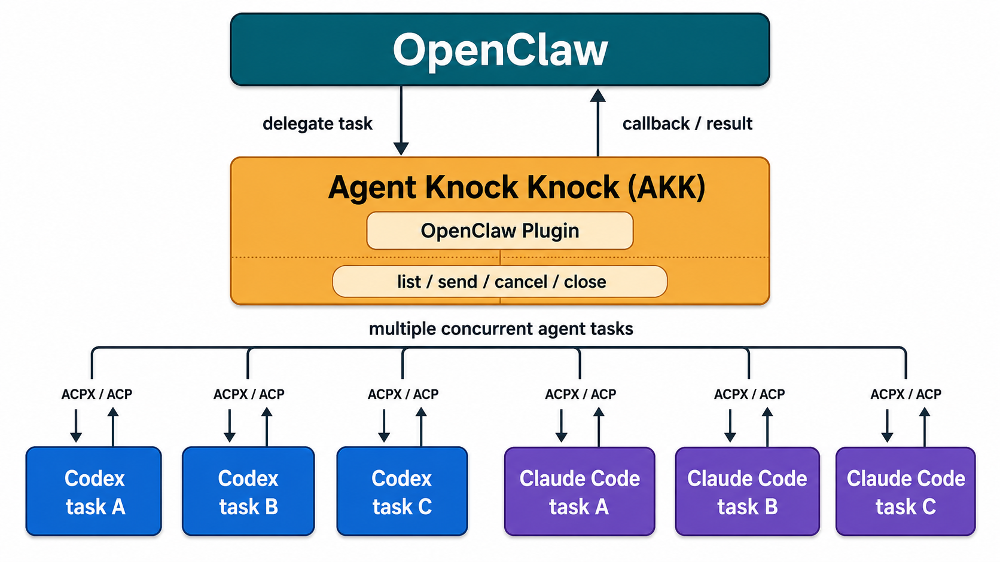

# agent-knock-knock

Agent Knock Knock lets OpenClaw delegate work to local coding agents such as Codex, Claude Code, and Cursor, keep those delegations alive as reusable tasks, and route follow-up messages or results back through OpenClaw.

The name is literal: OpenClaw knocks on the door of another coding agent, hands it a task, waits for the callback, and can knock again later with follow-up instructions. AKK provides the persistent task layer that makes that workflow practical across chat channels.

## Why This Exists

OpenClaw already has built-in session spawning, but persistent ACP sessions can depend on thread-bound channels such as Discord or Telegram. That model works well when the external channel can attach replies to a stable thread.

Channels such as WeChat and many direct-message surfaces do not provide that same thread primitive. Without an external thread, OpenClaw needs another durable place to remember which coding agents are working, which task each agent owns, and where follow-up messages should go.

Agent Knock Knock fills that gap. It keeps local task state outside the chat channel, uses ACPX / ACP to talk to coding agents, and gives OpenClaw tools to delegate, list, inspect, continue, cancel, and close work without relying on any external channel feature.

BTW, it can also [take over a Codex task](#native-codex-takeover) you started in a terminal, so when you are away from your computer, OpenClaw can still pick it up and keep going.

## What It Provides

- ACPX-backed delegation to Codex, Claude Code, and Cursor
- Reusable task sessions for follow-up messages after the first result
- Task listing, status inspection, follow-up send, cooperative cancellation, and local close
- Structured callbacks back into OpenClaw through the plugin Gateway method
- Conversation state stored in the user's home directory for recovery across OpenClaw turns
- Runtime diagnostics logs with local timestamps, redaction, and retention cleanup
- A short `AKK` routing convention for chat and `/akk` command surfaces

See [ROADMAP.md](ROADMAP.md) for planned reliability work and future orchestration features.

## Architecture

OpenClaw is the top-level orchestrator. Agent Knock Knock runs as the OpenClaw plugin bridge, uses ACPX / ACP to communicate with local coding agents, and keeps enough local task state for OpenClaw to manage many concurrent coding-agent sessions.



## Prerequisites

- Node.js 20+
- OpenClaw installed and running
- ACPX installed globally:

  ```bash
  npm install -g acpx
  acpx --version
  ```

- At least one local coding agent:
  - Codex, if you want Codex delegation
  - Claude Code, if you want Claude delegation
  - Cursor, if you want Cursor delegation

Agent Knock Knock does not manage Codex, Claude Code, or Cursor authentication. Make sure the agent you want to use is already installed and logged in before delegating tasks.

## Install

Install Agent Knock Knock globally:

```bash
npm install -g @scotthuang/agent-knock-knock
agent-knock-knock install-openclaw
agent-knock-knock doctor
```

`install-openclaw` installs and enables the OpenClaw plugin from the npm package, installs the Agent Knock Knock skill template, and restarts the OpenClaw Gateway by default. Use `--no-restart` if you want to restart the Gateway yourself.

If you are developing from a local checkout, you can ask OpenClaw to install it for you:

```text
Install this Agent Knock Knock project into my local OpenClaw:
1. Make sure Node.js 20+, OpenClaw, and at least one local coding agent such as Codex, Claude Code, or Cursor are installed.
2. Install ACPX globally if it is missing: npm install -g acpx.
3. Run npm install.
4. Run npm run build.
5. Link and enable the OpenClaw plugin from this repository.
6. Install the Agent Knock Knock skill template into ~/.openclaw/skills/agent-knock-knock/SKILL.md.
7. Restart the OpenClaw Gateway.
```

Local development installation:

Install the plugin into OpenClaw during local development:

```bash
npm install
npm run build
openclaw plugins install --link .
openclaw plugins enable agent-knock-knock
```

Install the OpenClaw skill template so OpenClaw learns when to route chat requests to AKK:

```bash
mkdir -p ~/.openclaw/skills/agent-knock-knock
cp templates/openclaw-skills/agent-knock-knock/SKILL.md ~/.openclaw/skills/agent-knock-knock/SKILL.md
```

Apply local project updates to OpenClaw:

```bash
npm install
npm run build
openclaw plugins install --link .
openclaw plugins enable agent-knock-knock
openclaw gateway restart
```

Run this after pulling new code or editing TypeScript/plugin files. The OpenClaw plugin loads compiled files from `dist/`, so source changes do not take effect until `npm run build` has run and the Gateway has reloaded the linked plugin. If the skill template changes, copy `templates/openclaw-skills/agent-knock-knock/SKILL.md` to `~/.openclaw/skills/agent-knock-knock/SKILL.md` again.

## OpenClaw Plugin

Use `AKK` or `akk` in OpenClaw chat to delegate coding work. If no agent is named, AKK uses the plugin `defaultAgent`; if that is unset, it falls back to Codex. Explicit agent names override the default.

Useful chat-style prompts:

```text
akk: fix the failing tests in this project
AKK Codex: review the current branch and propose a small fix
AKK Claude: review the latest commit
AKK Cursor: fix the flaky UI test
akk list
akk send <conversation-id>: continue with the smaller implementation
akk cancel <conversation-id>
akk close <conversation-id>
```

Surfaces that support OpenClaw native commands can use the same workflow through `/akk`:

```text
/akk <task>
/akk codex <task>
/akk claude <task>
/akk cursor <task>
/akk list
/akk status <conversation-id>
/akk send <conversation-id> <message>
/akk cancel <conversation-id>
/akk close <conversation-id> [reason]
```

Optional default-agent config:

```json5
{
  plugins: {
    entries: {
      "agent-knock-knock": {
        config: {
          defaultAgent: "codex" // "codex", "claude", or "cursor"
        }
      }
    }
  }
}
```

## Native Codex Takeover

Experimental: AKK can discover and take over Codex CLI sessions that were started outside AKK. This is useful when you started Codex in a terminal, left the machine, and want OpenClaw to continue managing that work from chat.

List current AKK-managed and local agent work:

```text
AKK list
```

`AKK list` returns separate groups for:

- `delegated`: AKK-managed background tasks.
- `native`: local native sessions that AKK can discover but cannot directly control.
- `terminal_controlled`: local sessions running in a controllable terminal provider such as tmux. These entries include terminal metadata, command capabilities, and concise approval state when a visible approval prompt is detected.

Takeover prompts:

```text
AKK safe resume Codex <native-session-id>
AKK takeover Codex <native-session-id>
AKK terminal takeover Codex <native-session-id>
AKK fork takeover Codex <native-session-id>
AKK approve <conversation-id>
```

Strategies:

- `safe resume`: attach a stopped/inactive Codex session to AKK.
- `takeover`: stop an active matching Codex CLI after explicit confirmation, then resume it under AKK.
- `terminal takeover`: attach an active Codex CLI running inside tmux after explicit confirmation. AKK sends follow-ups directly to the tmux pane and can approve the currently visible Codex approval prompt.
- `fork takeover`: keep the original Codex CLI running, ask OpenClaw to summarize bounded source context, then create a new AKK-managed fork from that summary.

For long-running local Codex sessions that you may want OpenClaw to operate from WeChat, run Codex inside tmux. AKK does not require tmux, but tmux enables terminal-control takeover without stopping the original process:

```bash
tmux new -s codex-work
codex
```

Avoid starting a second live client on the same active Codex session. It can mix session history in ways that neither live client sees until a later resume.

## Approval Behavior

AKK sends ACPX-backed coding-agent prompts with `--approve-all` so ACPX permission requests can proceed without an additional OpenClaw turn.

Claude Code permission requests work with this model. For example, a Claude Code write outside the repository workspace triggers ACPX `session/request_permission`; with `--approve-all`, ACPX approves the request and the write can complete.

Codex does not currently behave the same way for every sensitive operation under AKK. Some Codex sandbox-sensitive actions, such as writing outside the workspace in non-interactive execution, may fail directly with sandbox or permission errors instead of surfacing an ACPX permission request that AKK can approve. In those cases the action is currently unavailable through AKK's background Codex path; prefer Claude Code for tasks that require ACPX-approved filesystem access outside the workspace, or redesign the task to stay inside the configured workspace.

## Development

Build TypeScript sources:

```bash
npm run build
```

Run type checking without writing `dist/`:

```bash
npm run typecheck
```

Run the full test suite. This builds first, then runs the compiled TypeScript tests from `dist/test` against the compiled `dist/src` output:

```bash
npm test
```

Run a two-Claude simulation:

```bash
node scripts/two-claude-weather-test.js --location 广州
```

Run named simulations:

```bash
npm run simulate:architecture
npm run simulate:weather
```

Print a readable transcript from an NDJSON log:

```bash
npm run transcript -- --conversation .agent-knock-knock/conversations/<conversation-id>
```

You can also read a specific event log file:

```bash
npm run transcript -- --log .agent-knock-knock/conversations/<conversation-id>/events.ndjson
```

Include raw model exchange events when debugging prompt/response payloads:

```bash
npm run transcript -- --conversation .agent-knock-knock/conversations/<conversation-id> --include-raw
```

## Storage

Conversation state is stored under the user's home directory so a new OpenClaw session can recover the shared context independently from OpenClaw's own app state:

```text
~/.agent-knock-knock/
  conversations/
    <conversation-id>/
      state.json
      events.ndjson
      <agent>-output.log
  logs/
    runtime-YYYY-MM-DD.ndjson
```

Use `--store-dir <dir>` to override the conversation store location. `--log-dir <dir>` is still accepted as a compatibility alias. `<agent>-output.log` is diagnostic-only; OpenClaw should not read it as part of agent communication.

Runtime logs are diagnostic-only and are safe to use for local troubleshooting. They keep local timestamps, preserve useful absolute paths, redact common secrets, and are cleaned up by retention policy. Use `AKK_LOG_DIR`, `AKK_LOG_LEVEL`, and `AKK_LOG_RETENTION_DAYS` to override the defaults.

## Defaults

- Default agent: configured with `defaultAgent`; fallback is `codex`
- OpenClaw session: inherited from the current OpenClaw session; fallback is `agent:main:main`
- Delegated ACPX session: generated per new task, unless `session`, `codexSession`, `claudeSession`, or `cursorSession` is configured
- Agent callback timeout: `60` minutes before a waiting task is marked `stalled`
- Idle timeout: `10080` minutes before an idle task is lazily closed
- Soft response limit: `50` rounds
- Hard response limit: `100` rounds
- Store directory: `~/.agent-knock-knock/conversations`
- Runtime log directory: `~/.agent-knock-knock/logs`
- Runtime log retention: `14` days
- Codex model: unset by default; configure `codexModel` only when your ACPX Codex setup requires one
- Cursor model: unset by default; configure `cursorModel` only when your ACPX Cursor setup requires one

## Release

`package.json` is the version source. Create releases with npm's version command so the version commit and git tag stay aligned:

```bash
npm version patch
git push
git push --tags
```

Use `minor` for feature releases and `major` for breaking changes. Tags matching `v*` trigger the GitHub Actions release workflow, which runs the test suite, publishes `@scotthuang/agent-knock-knock` to npm with public access, and creates a GitHub Release from the tag notes.

The release workflow requires an `NPM_TOKEN` repository secret with permission to publish the npm package. GitHub's built-in `GITHUB_TOKEN` is used for creating the GitHub Release.

## Contributing

See [CONTRIBUTING.md](CONTRIBUTING.md) for local development, test, and pull request guidance.

## Security

Please do not open public issues for sensitive security reports. See [SECURITY.md](SECURITY.md).

## License

MIT. See [LICENSE](LICENSE).
