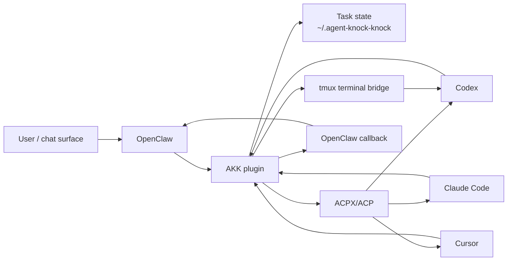

# agent-knock-knock


Agent Knock Knock (AKK) lets OpenClaw delegate work to local Codex, Claude Code, and Cursor agents, preserve each task for follow-ups, and route results back to chat—even on channels without threads. It can also discover and safely take over native Codex sessions.

## Install

Requirements:

- Node.js 20+
- OpenClaw installed and running
- [ACPX](https://github.com/openclaw/acpx) installed globally
- At least one authenticated coding agent: Codex, Claude Code, or Cursor

```bash
npm install -g acpx
npm install -g @scotthuang/agent-knock-knock
agent-knock-knock install-openclaw
agent-knock-knock doctor
```

`install-openclaw` installs or updates the plugin, enables it, installs the AKK skill template, and restarts the OpenClaw Gateway. It is safe to rerun. Use `--skill-only` to skip plugin installation; add `--no-restart` to skip the automatic Gateway restart.

If OpenClaw runs from a local checkout or another nonstandard location, pass its CLI explicitly:

```bash
agent-knock-knock install-openclaw --openclaw-bin /path/to/openclaw/openclaw.mjs
```

For local AKK development:

```bash
npm install
npm run build
node dist/src/cli.js install-openclaw
```

Rerun the build and installer after pulling or editing plugin sources. OpenClaw loads the compiled files from `dist/`.

## Quick Start

Start a task from an OpenClaw chat, then use its conversation ID for follow-ups:

```text
AKK Codex: inspect this repository and summarize it
AKK status <conversation-id>
AKK send <conversation-id>: run the tests and fix any failures
AKK list
```

If no agent is named, AKK uses the configured `defaultAgent`, falling back to Codex.

## Why AKK

OpenClaw can spawn agents directly, but persistent sessions may depend on channel threads. WeChat and many direct-message surfaces do not provide that primitive. AKK keeps task state outside the chat channel so OpenClaw can recover, inspect, and continue coding-agent work from any supported surface.

OpenClaw remains the orchestrator. AKK provides the plugin bridge, ACPX/ACP transport, durable task state, tmux terminal control, and structured callbacks.



See [ROADMAP.md](ROADMAP.md) for planned reliability and orchestration work.

## Usage

Use conversational `AKK` prompts on any chat surface. Explicit agent names override the configured default:

```text
AKK Claude: review the latest commit
AKK Cursor: fix the flaky UI test
AKK describe <conversation-id>
AKK recover <conversation-id>
```

Surfaces with native commands also support:

```text
/akk <task>
/akk codex <task>
/akk claude <task>
/akk cursor <task>
/akk list
/akk status <conversation-id>
/akk describe <conversation-id>
/akk send <conversation-id> <message>
/akk cancel <conversation-id>
/akk renew <conversation-id> [minutes]
/akk retry-callback <conversation-id>
/akk recover <conversation-id>
/akk close <conversation-id> [reason]
```

## Configuration

Configure AKK under `plugins.entries.agent-knock-knock.config` in `~/.openclaw/openclaw.json`:

```json5
{
  plugins: {
    entries: {
      "agent-knock-knock": {
        config: {
          defaultAgent: "codex",
          workspace: "/Users/scott/project"
        }
      }
    }
  }
}
```

| Option | Default | Purpose |
| --- | --- | --- |
| `defaultAgent` | `codex` | Agent used when a request does not name one. |
| `workspace` | OpenClaw process directory | Working directory for delegated tasks. |
| `storeDir` | `~/.agent-knock-knock/conversations` | Conversation state location. |
| `openclawBin` | Auto-detected | OpenClaw CLI used for callback delivery. |
| `codexAllProxy`, `cursorAllProxy`, `allProxy` | Unset | Per-agent or shared `ALL_PROXY` for ACPX launches. |
| `codexModel`, `cursorModel`, `model` | Unset | Per-agent or shared ACPX model override. |
| `defaultCodexSession`, `defaultClaudeSession`, `defaultCursorSession` | Generated per task | Named ACPX session to reuse. |
| `idleTimeoutMinutes` | `10080` | Time before an idle task is lazily closed. |
| `agentTimeoutMinutes` | `60` | Callback timeout; terminal bridges treat it as an inactivity timeout. |
| `agentHardTimeoutMinutes` | `720` | Maximum terminal bridge monitor lifetime. |
| `softLimit`, `hardLimit` | `50`, `100` | Response-requiring round limits. |

See [`openclaw.plugin.json`](openclaw.plugin.json) for the complete schema and compatibility aliases.

## Native Codex Takeover

Experimental: AKK can discover Codex CLI sessions started outside AKK. `AKK list` separates managed `delegated` tasks, discovered `native` sessions, and tmux-backed `terminal_controlled` sessions.

| Strategy | Behavior |
| --- | --- |
| `AKK takeover Codex <session-id>` | After confirmation, stop and attach the matching CLI; the next send resumes it. |
| `AKK terminal takeover Codex <session-id>` | After confirmation, control the existing tmux session without stopping it. |
| `AKK fork takeover Codex <session-id>` | Keep the original running and create a new task from an OpenClaw-approved summary. |

A terminal-controlled ID works directly with `send`, `status`, `describe`, `cancel`, and `approve`. Monitoring is activity-aware and has a separate hard lifetime. Use `renew` for a stalled monitor and `retry-callback` if callback delivery remains failed.

Start sessions you may want to control remotely inside tmux:

```bash
tmux new -s codex-work
codex
```

Avoid opening a second live client on the same Codex session; concurrent clients can produce inconsistent visible history.

## Approvals

AKK runs ACPX-backed agents with `--approve-all`. Claude Code surfaces permission requests through ACPX, but some Codex sandbox-sensitive operations fail directly. Keep Codex background work inside its workspace, or prefer Claude Code when a task requires ACPX-approved access elsewhere.

For tmux-backed Codex, AKK reports visible approval prompts through OpenClaw. Use `AKK approve <conversation-id>` to continue or `AKK cancel <conversation-id>` to deny and stop.

Trusted terminal commands can be auto-approved with a deterministic policy:

```json5
autoApprove: {
  enabled: true,
  rules: [{
    id: "project-read-status",
    agents: ["codex"],
    workspaces: ["/Users/scott/project"],
    commands: [
      ["pwd"],
      ["git", "status"],
      ["git", "diff", "--stat"]
    ]
  }]
}
```

Place `autoApprove` inside the plugin `config` object. It is disabled by default and applies only to exact Codex `run command` argument vectors inside configured workspaces. Shell composition, substitutions, globs, environment assignments, unparseable commands, and out-of-workspace paths always require user approval. AKK rechecks the visible prompt immediately before approval and records the matched rule and policy fingerprint.

## Troubleshooting

Start with `agent-knock-knock doctor`. It checks Node.js, OpenClaw, ACPX, at least one supported coding-agent command, and the packaged plugin files. The OpenClaw CLI must be on `PATH` or in a common user install directory for this check.

| Symptom | Action |
| --- | --- |
| Installer or callbacks cannot find a local OpenClaw CLI | Set `openclawBin` and pass `--openclaw-bin` to `install-openclaw`. |
| Source changes do not appear | Build, reinstall from the checkout, and restart the Gateway. |
| Terminal bridge task is `stalled` | Run `AKK renew <conversation-id> --minutes <minutes>`. |
| ACPX task is `stalled` | Inspect `status --trace`; close and redelegate if the executor cannot continue. |
| Task is `callback_failed` | Run `AKK retry-callback <conversation-id>`. |
| Codex delegation rejects the deprecated adapter | Remove the old override or select a supported adapter as described below. |
| Terminal takeover is unavailable | Run Codex inside tmux and check `AKK list` for a `terminal_controlled` entry. |

For local diagnostics, use:

```bash
agent-knock-knock status --conversation <conversation-id> --trace
agent-knock-knock list --terminal-debug
agent-knock-knock list --managed-only # skip native and terminal discovery
```

### Codex ACP Adapter

Codex delegation uses `npx -y @agentclientprotocol/codex-acp@^1.1.0` by default and rejects the deprecated `@zed-industries/codex-acp`. The first run may take longer while `npx` downloads the adapter. To select another compatible adapter, set this in the environment that runs OpenClaw/AKK:

```bash
export AKK_CODEX_ACPX_AGENT_COMMAND='your-compatible-adapter-command'
```

## Development

```bash
npm run build                 # compile TypeScript into dist/
npm run typecheck             # check types without writing output
npm test                      # build and run the full test suite
npm run simulate:architecture # run a named two-agent simulation
npm run simulate:weather
npm run transcript -- --conversation ~/.agent-knock-knock/conversations/<conversation-id>
```

Pass `--include-raw` to the transcript command only when debugging model exchange events. See [CONTRIBUTING.md](CONTRIBUTING.md) for the development and pull request workflow.

## Storage and Logs

```text
~/.agent-knock-knock/
  conversations/
    <conversation-id>/
      state.json
      events.ndjson
      <agent>-output.log
  logs/
    runtime-YYYY-MM-DD.ndjson
```

Use `--store-dir <dir>` to override the conversation store; `--log-dir` remains a compatibility alias. Agent output and runtime logs are diagnostic-only and are not part of OpenClaw-agent communication.

Runtime logs use local timestamps, redact common secrets, and are cleaned by retention policy. Configure them with `AKK_LOG_DIR`, `AKK_LOG_LEVEL`, and `AKK_LOG_RETENTION_DAYS`. Defaults are `~/.agent-knock-knock/logs` and 14 days.

## Release

`package.json` is the version source. Create a release with npm's version command, then push the commit and tag:

```bash
npm version patch # or minor / major
git push
git push --tags
```

Tags matching `v*` run the release workflow, which tests the package, publishes it to npm, and creates a GitHub Release. Publishing requires an `NPM_TOKEN` repository secret.

## Security

Do not open public issues for sensitive security reports. See [SECURITY.md](SECURITY.md).

## License

MIT. See [LICENSE](LICENSE).
