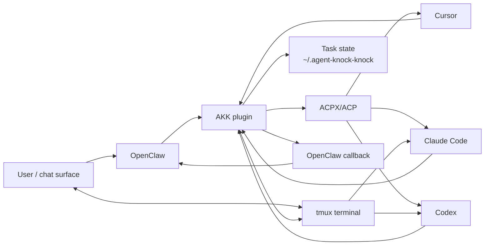

# Agent Knock Knock (AKK)

[](https://www.npmjs.com/package/@scotthuang/agent-knock-knock)
[](https://github.com/scotthuang/agent-knock-knock/actions/workflows/ci.yml)
[](https://nodejs.org/)
[](https://github.com/scotthuang/agent-knock-knock/blob/main/LICENSE)

Agent Knock Knock turns OpenClaw into a control plane for local coding agents: delegate new work, preserve task state for follow-ups, and route results back to the original chat—even on channels without threads.


AKK provides two complementary execution paths, plus Codex-native discovery and takeover:

| Path | Use it for | Agents |
| --- | --- | --- |
| **ACPX / ACP** | Launch a new AKK-managed task with durable state and callbacks. | Codex, Claude Code, Cursor |
| **tmux bridge (experimental)** | Hand an existing live CLI session between OpenClaw and a human without starting another coding-agent process. | Codex, Claude Code |
| **Native discovery and takeover** | Discover, resume, or fork a local native session. | Codex |

[ACPX](https://github.com/openclaw/acpx) is the ACP client AKK uses for managed delegation; it is independent of tmux. Claude hooks are required only for structured approval and completion handling in Claude Code tmux sessions. Cursor tmux control is [not yet supported](https://github.com/scotthuang/agent-knock-knock/issues/42).

## Install

Requirements:

- Node.js 22.14+ (Node.js 24 recommended; use a version supported by your OpenClaw release)
- [OpenClaw](https://docs.openclaw.ai/) Gateway and plugin API `2026.3.24-beta.2` or newer
- [ACPX](https://github.com/openclaw/acpx) installed globally
- At least one authenticated coding agent: Codex, Claude Code, or Cursor
- For terminal control: a Unix-like host and `tmux`, with Codex or Claude Code running in a pane owned by the same user as OpenClaw

```bash
npm install -g acpx
npm install -g @scotthuang/agent-knock-knock
agent-knock-knock install-openclaw
agent-knock-knock doctor
```

`install-openclaw` installs or updates the plugin, enables it, installs the AKK skill template, and restarts the OpenClaw Gateway. It is safe to rerun. Use `--skill-only` to skip plugin installation; add `--no-restart` to skip the automatic Gateway restart.

> **Security:** ACPX delegations currently run with `--approve-all`. Treat them as trusted local automation, set an explicit workspace, and review the coding agent's own sandbox and credentials. tmux approval handling is separate and fails closed; terminal auto-approval is disabled by default.

AKK's normal plugin callback uses OpenClaw's own Gateway configuration and does not put the Gateway token in the coding-agent prompt or child-process arguments. Keep credentials out of a custom `callbackCommand`. The legacy direct CLI `--token` callback remains only for compatibility and embeds that credential in its callback command; do not use it for untrusted delegations.

To control Claude Code in tmux, install AKK's structured hooks once:

```bash
agent-knock-knock install-claude-hooks
```

The installer merges AKK hooks into `~/.claude/settings.json` and preserves existing settings and hooks. Rerun it if the AKK executable path changes. It is not needed for ACPX delegation.

If OpenClaw runs from a local checkout or another nonstandard location, pass its CLI explicitly:

```bash
agent-knock-knock install-openclaw --openclaw-bin /path/to/openclaw/openclaw.mjs
```

## Quick Start

First merge this configuration into `~/.openclaw/openclaw.json`, setting `workspace` to the absolute path of the project agents may modify:

```json5
// ~/.openclaw/openclaw.json
{
  plugins: {
    entries: {
      "agent-knock-knock": {
        config: {
          defaultAgent: "codex",
          workspace: "/absolute/path/to/project"
        }
      }
    }
  }
}
```

Restart the Gateway after changing the configuration:

```bash
openclaw gateway restart
```

Then start a task from an OpenClaw chat and use the returned conversation ID for follow-ups:

```text
AKK Codex: inspect this repository and summarize it
AKK status <conversation-id>
AKK send <conversation-id>: run the tests and fix any failures
AKK list
```

If no agent is named, AKK uses the configured `defaultAgent`, falling back to Codex.

## Why AKK

OpenClaw can spawn agents directly, but persistent sessions may depend on channel threads. WeChat and many direct-message surfaces do not provide that primitive. AKK keeps task state outside the chat channel so OpenClaw can recover, inspect, and continue coding-agent work from any supported surface.

OpenClaw remains the orchestrator. AKK provides the plugin bridge, ACPX/ACP transport, durable task state, tmux terminal control, and structured callbacks. The tmux path is a handoff: avoid typing into a pane while AKK is driving the same turn.



See the [roadmap](https://github.com/scotthuang/agent-knock-knock/blob/main/ROADMAP.md) for planned reliability and orchestration work.

## Usage

Use conversational `AKK` prompts on any chat surface. Explicit agent names override the configured default:

```text
AKK Claude: review the latest commit
AKK Cursor: fix the flaky UI test
AKK describe <conversation-id>
AKK recover <conversation-id>
```

Surfaces with native commands also support:

```text
/akk <task>
/akk codex <task>
/akk claude <task>
/akk cursor <task>
/akk list
/akk status <conversation-id>
/akk describe <conversation-id>
/akk send <conversation-id> <message>
/akk cancel <conversation-id>
/akk renew <conversation-id> [minutes]
/akk retry-callback <conversation-id>
/akk recover <conversation-id>
/akk close <conversation-id> [reason]
```

## Configuration

Configure AKK under `plugins.entries.agent-knock-knock.config` in `~/.openclaw/openclaw.json`, as shown in the Quick Start.

| Option | Default | Purpose |
| --- | --- | --- |
| `defaultAgent` | `codex` | Agent used when a request does not name one. |
| `workspace` | OpenClaw process directory | Working directory for delegated tasks. |
| `storeDir` | `~/.agent-knock-knock/conversations` | Conversation state location; relative plugin paths resolve from `workspace`. |
| `openclawBin` | Auto-detected | OpenClaw CLI used for callback delivery. |
| `codexAllProxy`, `cursorAllProxy`, `allProxy` | Unset | Per-agent or shared `ALL_PROXY` for ACPX launches. |
| `codexModel`, `cursorModel`, `model` | Unset | Per-agent or shared ACPX model override. |
| `defaultCodexSession`, `defaultClaudeSession`, `defaultCursorSession` | Generated per task | Named ACPX session to reuse. |
| `idleTimeoutMinutes` | `10080` | Time before an idle task is lazily closed. |
| `agentTimeoutMinutes` | `60` | Callback timeout; terminal bridges treat it as an inactivity timeout. |
| `agentHardTimeoutMinutes` | `720` | Maximum terminal bridge monitor lifetime. |
| `softLimit`, `hardLimit` | `50`, `100` | Response-requiring round limits. |

See [`openclaw.plugin.json`](openclaw.plugin.json) for the complete schema and compatibility aliases.

## Native Sessions and tmux Control

Experimental: AKK can discover Codex CLI sessions started outside AKK and control Codex or Claude Code sessions in tmux. `AKK list` separates managed `delegated` tasks, discovered `native` sessions, and tmux-backed `terminal_controlled` sessions. Native stop/resume and fork takeover remain Codex-only.

| Strategy | Behavior |
| --- | --- |
| `AKK takeover Codex <session-id>` | After confirmation, stop and attach the matching CLI; the next send resumes it. |
| `AKK terminal takeover Codex <session-id>` | After confirmation, control the existing tmux session without stopping it. |
| `AKK fork takeover Codex <session-id>` | Keep the original running and create a new task from an OpenClaw-approved summary. |

A terminal-controlled ID works directly with `send`, `status`, `describe`, and `cancel`. Claude accepts new messages only at a verified idle prompt. Codex visible prompts can also be approved directly. Claude structured approval and durable monitoring require a managed lease: use `send --background` first (the OpenClaw send tool already does this), then use the returned managed conversation ID with `approve`, `cancel`, or `status`. Monitoring is activity-aware, survives Gateway restarts when AKK can revalidate the exact task, and has a separate hard lifetime. Use `renew` for a stalled monitor and `retry-callback` if callback delivery remains failed.

New terminal-controlled IDs use `terminal:v2:tmux:<agent>:<target>:<pid>`, for example `terminal:v2:tmux:claude:claude-work:0.1:33389`. Legacy `terminal:tmux:<target>:<pid>` IDs remain valid and are treated as Codex. Cursor tmux sessions are not yet supported.

Start sessions you may want to control remotely inside tmux:

```bash
tmux new -s codex-work
codex

tmux new -s claude-work
claude
```

For Claude Code, `send --background` creates the managed lease that binds hook events to the exact session, terminal, conversation, and message. A `Stop` event produces one callback from `last_assistant_message` only after background tasks and scheduled jobs have finished; `StopFailure` produces an actionable error. If hooks are unavailable or identity is stale or ambiguous, AKK can still discover, send, and inspect through tmux, but it will not approve or claim durable completion. `cancel` uses Escape only when no unverified permission dialog is visible; unsafe dialogs must be resolved manually in the terminal.

Avoid opening a second live client on the same agent session; concurrent clients can produce inconsistent visible history.

## Approvals

AKK runs ACPX-backed agents with `--approve-all`. Claude Code surfaces permission requests through ACPX, but some Codex sandbox-sensitive operations fail directly. Keep Codex background work inside its workspace, or prefer Claude Code when a task requires ACPX-approved access elsewhere.

For tmux-backed Codex, AKK reports visible approval prompts. For Claude Code, the installed hook reports structured `PermissionRequest` events and AKK shows the tool name plus a redacted, bounded target summary without copying the full tool input. Inspect the current request through OpenClaw, then use `AKK approve <conversation-id>` to allow it or `AKK cancel <conversation-id>` to deny and stop. Unknown, stale, or ambiguous requests are never approved or interrupted by synthetic keys; resolve those dialogs manually in the terminal.

Trusted terminal commands can be auto-approved with a deterministic policy:

```json5
autoApprove: {
  enabled: true,
  rules: [{
    id: "project-read-status",
    agents: ["codex", "claude"],
    workspaces: ["/absolute/path/to/project"],
    commands: [
      ["pwd"],
      ["git", "status"],
      ["git", "diff", "--stat"]
    ]
  }]
}
```

Place `autoApprove` inside the plugin `config` object. It is disabled by default and applies only to exact Codex run-command or Claude Code `Bash` argument vectors inside configured workspaces. Shell composition, substitutions, globs, environment assignments, unparseable commands, and out-of-workspace paths always require user approval. AKK revalidates the current request immediately before approval and records the matched rule and policy fingerprint. Enable it only with a trusted `PATH` and workspace: rules match command arguments, not executable hashes.

## Troubleshooting

Start with `agent-knock-knock doctor`. It checks for Node.js 22.14+, OpenClaw, ACPX, at least one supported coding-agent command, and the packaged plugin files. It does not authenticate an agent, verify live Gateway/plugin connectivity, or run a real delegation. The OpenClaw CLI must be on `PATH` or in a common user install directory for this check.

| Symptom | Action |
| --- | --- |
| Installer or callbacks cannot find a local OpenClaw CLI | Set `openclawBin` and pass `--openclaw-bin` to `install-openclaw`. |
| Source changes do not appear | Build, reinstall from the checkout, and restart the Gateway. |
| Terminal bridge task is `stalled` | Run `/akk renew <conversation-id> <minutes>` in a native-command chat, or ask OpenClaw to renew it. |
| ACPX task is `stalled` | Inspect `status --trace`; close and redelegate if the executor cannot continue. |
| Task is `callback_failed` | Run `/akk retry-callback <conversation-id>` in a native-command chat. |
| Codex delegation rejects the deprecated adapter | Remove the old override or select a supported adapter as described below. |
| Terminal takeover is unavailable | Run Codex or Claude Code inside tmux and check `AKK list` for a `terminal_controlled` entry. |
| An upgraded tmux task reports no exact agent PID | List the live terminal session and attach it again; AKK migrates only an unambiguous legacy Codex session/pane match. |
| Claude permission or completion is not detected | Run `agent-knock-knock install-claude-hooks`, then retry in the managed tmux session. |

For local diagnostics, use:

```bash
agent-knock-knock status --conversation <conversation-id> --trace
agent-knock-knock list --terminal-debug
agent-knock-knock list --managed-only # skip native and terminal discovery
```

### Codex ACP Adapter

Codex delegation uses the tested, pinned adapter `npx -y @agentclientprotocol/codex-acp@1.1.7` by default and rejects the deprecated `@zed-industries/codex-acp`. The first run may take longer while `npx` downloads the adapter. To select another compatible adapter, set this in the environment that runs OpenClaw/AKK:

```bash
export AKK_CODEX_ACPX_AGENT_COMMAND='your-compatible-adapter-command'
```

## Development

```bash
npm run build                 # compile TypeScript into dist/
npm run typecheck             # check types without writing output
npm test                      # build and run the full test suite
npm run simulate:architecture # run a named two-agent simulation
npm run simulate:weather
npm run transcript -- --conversation ~/.agent-knock-knock/conversations/<conversation-id>
```

Pass `--include-raw` to the transcript command only when debugging model exchange events. See [CONTRIBUTING.md](https://github.com/scotthuang/agent-knock-knock/blob/main/CONTRIBUTING.md) for the development and pull request workflow.

For local OpenClaw testing, run `node dist/src/cli.js install-openclaw` after each build or plugin-source update. OpenClaw loads the compiled files from `dist/`.

## Storage and Logs

```text
~/.agent-knock-knock/
  conversations/
    <conversation-id>/
      state.json
      events.ndjson
      <agent>-output.log
  logs/
    runtime-YYYY-MM-DD.ndjson
```

Use `--store-dir <dir>` to override the conversation store with a dedicated private directory; `--log-dir` remains a compatibility alias. Agent output and runtime logs are diagnostic-only and are not part of OpenClaw-agent communication.

AKK keeps its store and conversation directories at `0700` and state, event, agent-output, and runtime-log files at `0600`. Runtime logs use local timestamps, redact common secrets, and are cleaned by retention policy. Configure them with `AKK_LOG_DIR`, `AKK_LOG_LEVEL`, and `AKK_LOG_RETENTION_DAYS`. Defaults are `~/.agent-knock-knock/logs` and 14 days. A custom `AKK_LOG_DIR` must be empty or dedicated to AKK; shared directories are rejected without changing their permissions.

## Release

`package.json` is the version source. Update it, `package-lock.json`, and the changelog in the release PR. After that commit reaches `main`, tag the exact version:

```bash
AKK_RELEASE_VERSION="$(node -p "require('./package.json').version")"
git tag "v${AKK_RELEASE_VERSION}"
git push origin "v${AKK_RELEASE_VERSION}"
```

Tags matching `v*` run the release workflow, which tests the package, publishes it to npm, and creates a GitHub Release. Publishing requires an `NPM_TOKEN` repository secret.

## Security

Do not open public issues for sensitive security reports. See the [security policy](https://github.com/scotthuang/agent-knock-knock/blob/main/SECURITY.md).

## License

MIT. See [LICENSE](https://github.com/scotthuang/agent-knock-knock/blob/main/LICENSE).
