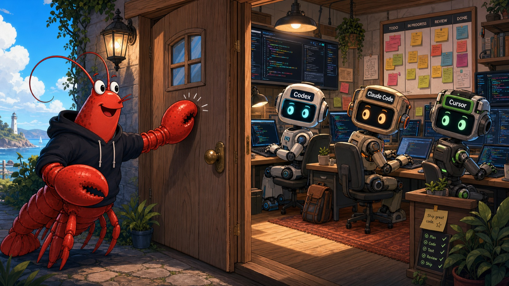

# Agent Knock Knock (AKK)

[](https://www.npmjs.com/package/@scotthuang/agent-knock-knock)
[](https://github.com/scotthuang/agent-knock-knock/actions/workflows/ci.yml)
[](https://nodejs.org/)
[](https://github.com/scotthuang/agent-knock-knock/blob/main/LICENSE)

Agent Knock Knock connects OpenClaw to local coding agents. Share a live terminal through tmux, delegate managed work through ACP, and continue the same task from chat or the terminal.



## Choose an Execution Mode

| Mode | Best for | Agents | Requires |
| --- | --- | --- | --- |
| **tmux bridge (recommended, experimental)** | Share one live CLI session. OpenClaw and a human can hand the task back and forth. | Codex, Claude Code | `tmux` |
| **Managed ACP** | Start background tasks with durable ACP state and callbacks. | Codex, Claude Code, Cursor | [ACPX](https://github.com/openclaw/acpx) |

Install either mode or both. tmux does not require ACPX. Cursor tmux control is [not yet supported](https://github.com/scotthuang/agent-knock-knock/issues/42). AKK can also discover, resume, or fork local Codex sessions; that is a Codex capability, not a third installation mode.

## Install

Core requirements:

- Node.js 22.14+ (Node.js 24 recommended; use a version supported by your OpenClaw release)
- [OpenClaw](https://docs.openclaw.ai/) Gateway and plugin API `2026.3.24-beta.2` or newer
- At least one authenticated coding agent: Codex, Claude Code, or Cursor

```bash
npm install -g @scotthuang/agent-knock-knock
agent-knock-knock install-openclaw
```

`install-openclaw` installs or updates the plugin, enables it, installs the AKK skill template, and restarts the OpenClaw Gateway. It is safe to rerun. Use `--skill-only` to skip plugin installation; add `--no-restart` to skip the automatic Gateway restart.

Then enable at least one execution mode:

- **tmux (recommended):** install `tmux` on a Unix-like host and run Codex or Claude Code in a pane owned by the same user as OpenClaw.
- **Managed ACP:** install ACPX with `npm install -g acpx`.

Claude tmux support requires no hooks and does not modify Claude Code settings. Hook-free completion monitoring currently accepts the verified Claude Code `2.1.198` interactive transcript schema and fails closed on unknown schemas.

If OpenClaw runs from a local checkout or another nonstandard location, pass its CLI explicitly:

```bash
agent-knock-knock install-openclaw --openclaw-bin /path/to/openclaw/openclaw.mjs
```

Finally, check which modes are ready:

```bash
agent-knock-knock doctor
```

### Trust and Privacy

AKK is local-first: its state, logs, and terminal control stay on your machine. AKK has no hosted control plane or telemetry, and its tmux integration does not modify coding-agent settings.

For a managed Claude tmux turn, AKK reads only the bytes appended to Claude Code's owner-private local JSONL transcript after the send boundary. It uses them locally to bind the exact prompt and extract a redacted final answer; it does not upload the transcript or persist a copy of its raw contents. The final answer still travels through your configured local OpenClaw callback.

This does not mean task content can never leave the machine. OpenClaw and each coding agent or model provider still process content according to your configuration. Managed ACP tasks currently use ACPX `--approve-all`; treat them as trusted automation, set an explicit workspace, and review the agent's sandbox and credentials.

AKK's normal callback uses the OpenClaw Gateway configuration without putting its token in the agent prompt or child-process arguments. Keep credentials out of a custom `callbackCommand`. The legacy direct CLI `--token` callback embeds that credential in its callback command and should not be used for untrusted delegations.

## Quick Start

First merge this configuration into `~/.openclaw/openclaw.json`, setting `workspace` to the absolute path of the project agents may modify:

```json5
// ~/.openclaw/openclaw.json
{
  plugins: {
    entries: {
      "agent-knock-knock": {
        config: {
          defaultAgent: "codex",
          workspace: "/absolute/path/to/project"
        }
      }
    }
  }
}
```

Restart the Gateway after changing the configuration:

```bash
openclaw gateway restart
```

For the recommended tmux mode, start an agent in tmux, then ask AKK to list and send to the discovered terminal:

```bash
tmux new -s claude-work
claude
```

```text
AKK list
AKK send <terminal-controlled-id>: inspect this repository and summarize it
AKK status <managed-conversation-id>
```

Attach to the same tmux session whenever you want to take over directly. Avoid typing while AKK is sending the same turn.

For Managed ACP, start a new task and use its conversation ID for follow-ups:

```text
AKK Codex: inspect this repository and summarize it
AKK status <conversation-id>
AKK send <conversation-id>: run the tests and fix any failures
```

For new ACP tasks, omitting the agent uses `defaultAgent`, falling back to Codex.

## How It Works

AKK keeps task state outside the chat channel, so OpenClaw can inspect and continue work even where threads are unavailable. OpenClaw remains the orchestrator; AKK supplies the ACP transport, tmux bridge, local state, and callbacks. See the [roadmap](https://github.com/scotthuang/agent-knock-knock/blob/main/ROADMAP.md) for planned work.

## Usage

Use conversational `AKK` prompts on any chat surface. Explicit agent names override the configured default:

```text
AKK Claude: review the latest commit
AKK Cursor: fix the flaky UI test
AKK describe <conversation-id>
AKK recover <conversation-id>
```

Surfaces with native commands use the same operations:

```text
/akk <task>
/akk list
/akk status <conversation-id>
/akk describe <conversation-id>
/akk send <conversation-id> <message>
/akk cancel <conversation-id>
/akk renew <conversation-id> [minutes]
/akk retry-callback <conversation-id>
/akk close <conversation-id> [reason]
```

## Configuration

Configure AKK under `plugins.entries.agent-knock-knock.config` in `~/.openclaw/openclaw.json`, as shown in the Quick Start.

| Option | Default | Purpose |
| --- | --- | --- |
| `defaultAgent` | `codex` | Agent used when a request does not name one. |
| `workspace` | OpenClaw process directory | Working directory for delegated tasks. |
| `storeDir` | `~/.agent-knock-knock/conversations` | Conversation state location; relative plugin paths resolve from `workspace`. |
| `openclawBin` | Auto-detected | OpenClaw CLI used for callback delivery. |
| `idleTimeoutMinutes` | `10080` | Time before an idle task is lazily closed. |
| `agentTimeoutMinutes` | `60` | Callback timeout; terminal bridges treat it as an inactivity timeout. |
| `agentHardTimeoutMinutes` | `720` | Maximum terminal bridge monitor lifetime. |

See [`openclaw.plugin.json`](openclaw.plugin.json) for the complete schema and compatibility aliases.

## Native Sessions and tmux Control

AKK can discover Codex CLI sessions started outside AKK and control Codex or Claude Code sessions in tmux. `AKK list` separates managed `delegated` tasks, discovered `native` sessions, and tmux-backed `terminal_controlled` sessions. Native stop/resume and fork takeover remain Codex-only:

```text
AKK takeover Codex <session-id>
AKK terminal takeover Codex <session-id>
AKK fork takeover Codex <session-id>
```

A terminal-controlled ID works with `send`, `status`, `describe`, `approve`, and `cancel`. Claude accepts new messages only at a verified idle prompt. Use `send --background` (the OpenClaw send tool does this automatically) to bind a managed turn, then use the returned conversation ID with `approve`, `cancel`, or `status`.

Claude tmux support is hook-free: AKK can discover the session, send at a verified idle prompt, report status, handle a narrowly verified approval, and detect completion for a verified local transcript schema. Before sending, AKK binds the Claude PID, process start time, session ID, cwd, and transcript file boundary. Completion requires the exact managed prompt, its UUID chain, an `end_turn` assistant response, a matching `turn_duration`, an idle unchanged process, and two stable monitor polls.

This detector is deliberately conservative. An unknown Claude version or schema, partial or replaced transcript, ambiguous prompt, unresolved tool call, sidechain, or background work does not become `done`; the monitor remains pending and may eventually become `stalled`. `Agent`, `SendMessage`, and scheduled/background tool turns currently take this safe path because their child lifecycle is not fully visible in the main transcript. A visible idle prompt alone is never completion evidence.

Avoid opening a second live client on the same agent session; concurrent clients can produce inconsistent visible history.

## Approvals

AKK runs ACPX-backed agents with `--approve-all`. Claude Code surfaces permission requests through ACPX, but some Codex sandbox-sensitive operations fail directly. Keep Codex background work inside its workspace, or prefer Claude Code when a task requires ACPX-approved access elsewhere.

For tmux-backed Codex, AKK reports visible approval prompts. Claude approval is deliberately narrower:

- It is available only for the current AKK-managed turn.
- AKK accepts only an exact, current Bash dialog with the one-time **Yes** choice already highlighted. Persistent permission choices are rejected.
- A human must explicitly run `AKK approve <conversation-id>`. AKK never auto-approves Claude tmux requests.
- The request is short-lived, fingerprinted to the terminal and managed-turn identity, and captured and validated again immediately before AKK sends Enter. Each dispatch is reserved first; an uncertain outcome fails closed and must be resolved in the terminal.

Unknown, stale, changed, ambiguous, or unmanaged dialogs fail closed and must be resolved in the terminal.

Trusted Codex terminal commands can optionally be auto-approved with a deterministic policy:

```json5
autoApprove: {
  enabled: true,
  rules: [{
    id: "project-read-status",
    agents: ["codex"],
    workspaces: ["/absolute/path/to/project"],
    commands: [["pwd"], ["git", "status"], ["git", "diff", "--stat"]]
  }]
}
```

Place `autoApprove` inside the plugin `config` object. It is disabled by default and matches only exact Codex argument vectors in configured workspaces. Shell composition, substitutions, globs, environment assignments, unparseable commands, and out-of-workspace paths require manual approval. Rules match arguments, not executable hashes.

## Troubleshooting

Start with `agent-knock-knock doctor`. It checks the core installation and reports ACPX and tmux readiness separately; either execution mode is enough. It does not authenticate an agent, verify live Gateway/plugin connectivity, or run a real task.

| Symptom | Action |
| --- | --- |
| Installer or callbacks cannot find a local OpenClaw CLI | Set `openclawBin` and pass `--openclaw-bin` to `install-openclaw`. |
| Source changes do not appear | Build, reinstall from the checkout, and restart the Gateway. |
| Terminal bridge task is `stalled` | Inspect `status` and the terminal; use `/akk renew <conversation-id> <minutes>` only when more monitoring time is useful. |
| ACPX task is `stalled` | Inspect `status --trace`; close and redelegate if the executor cannot continue. |
| Task is `callback_failed` | Run `/akk retry-callback <conversation-id>` in a native-command chat. |
| Terminal takeover is unavailable | Run Codex or Claude Code inside tmux and check `AKK list` for a `terminal_controlled` entry. |
| Claude permission is not offered through AKK | Use the managed conversation returned by a background send. If the dialog is not the exact supported one-time Bash prompt, resolve it in the terminal. |
| Claude tmux monitor becomes `stalled` | Check the Claude version and `status`, then inspect the terminal. Unknown transcript schemas, background work, identity changes, and ambiguous turns intentionally fail closed. |

For local diagnostics, use:

```bash
agent-knock-knock status --conversation <conversation-id> --trace
agent-knock-knock list --terminal-debug
agent-knock-knock list --managed-only
```

Codex ACP uses the pinned `@agentclientprotocol/codex-acp` adapter. Override it only with a compatible command through `AKK_CODEX_ACPX_AGENT_COMMAND`.

## Development

```bash
npm run build                 # compile TypeScript into dist/
npm run typecheck             # check types without writing output
npm test                      # build and run the full test suite
```

See [CONTRIBUTING.md](https://github.com/scotthuang/agent-knock-knock/blob/main/CONTRIBUTING.md) for the development and pull request workflow. For local OpenClaw testing, rebuild, run `node dist/src/cli.js install-openclaw`, and restart the Gateway.

## Storage and Logs

State lives under `~/.agent-knock-knock/`. Directories use mode `0700`; state and log files use `0600`. Runtime logs redact common secrets and default to 14-day retention. Configure storage and logging with `--store-dir`, `AKK_LOG_DIR`, `AKK_LOG_LEVEL`, and `AKK_LOG_RETENTION_DAYS`; use a dedicated custom log directory.

## Security

Do not open public issues for sensitive security reports. See the [security policy](https://github.com/scotthuang/agent-knock-knock/blob/main/SECURITY.md).

## License

MIT. See [LICENSE](https://github.com/scotthuang/agent-knock-knock/blob/main/LICENSE).
