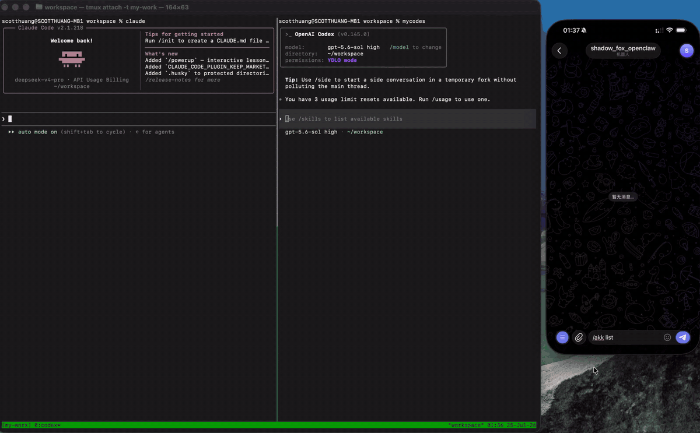
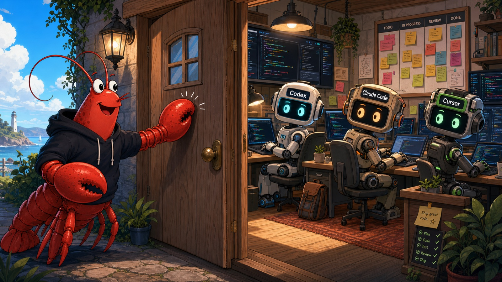

# Agent Knock Knock (AKK)

[](https://www.npmjs.com/package/@scotthuang/agent-knock-knock)
[](https://github.com/scotthuang/agent-knock-knock/actions/workflows/ci.yml)
[](https://nodejs.org/)
[](https://github.com/scotthuang/agent-knock-knock/blob/main/LICENSE)

Agent Knock Knock lets you control local Codex and Claude Code from any configured OpenClaw channel, then take over the same live tmux session without losing context. For managed background work, Managed ACP (via ACPX) also supports Cursor.

**Local-first, with no hosted control plane or telemetry. tmux mode keeps the coding agent's existing permission settings; Managed ACP uses a separate background permission model.**

## See It in Action

[](docs/assets/akk-tmux-handoff-demo.mp4)

*OpenClaw asks Claude Code to write a file, waits for AKK to report completion, then hands the result to Codex. Both terminals remain available for direct human takeover. The demo uses the agents' existing permission settings; AKK does not switch them. Click the preview to watch in full quality.*

## Use Cases

**Delegate from anywhere.** Use any configured OpenClaw channel to hand work to a local coding agent wherever you are. AKK keeps the task running outside the chat, reports when the agent needs input or finishes, and lets you continue from chat or the shared terminal.

**Orchestrate specialist agents.** OpenClaw can coordinate agent handoffs: Claude Code can plan, Codex can implement, and Claude Code can review. In tmux mode, AKK can also automatically approve trusted permission requests under rules you define. At any point, you can take over the shared terminal, keep working yourself, then hand the same task back to OpenClaw—with context intact.



## Choose an Execution Mode

| Mode | Best for | Agents | Requires |
| --- | --- | --- | --- |
| **tmux bridge (recommended)** | Share one live CLI session. OpenClaw and a human can hand the task back and forth. | Codex, Claude Code | `tmux` |
| **Managed ACP** | Start background tasks with durable ACP state and callbacks. | Codex, Claude Code, Cursor | [ACPX](https://github.com/openclaw/acpx) |

Install either mode or both. tmux does not require ACPX. Cursor tmux control is [not yet supported](https://github.com/scotthuang/agent-knock-knock/issues/42). AKK can also discover, resume, or fork local Codex sessions; that is a Codex capability, not a third installation mode.

### Permission Boundaries

The two modes intentionally use different permission models:

- **tmux bridge:** AKK does not change the coding agent's configured permission mode. For supported prompts in an AKK-managed turn, disabled-by-default exact-command rules may auto-approve a trusted request; unmatched or uncertain requests stay manual.
- **Managed ACP:** AKK starts ACPX-backed agents with `--approve-all`; the tmux prompt inspection and exact-command `autoApprove` policy do not apply to this mode. Claude Code may still surface permission requests through ACPX, while some Codex sandbox-sensitive operations fail directly. Keep managed work inside an explicit workspace.

## Install

Core requirements:

- Node.js 22.14+ (Node.js 24 recommended; use a version supported by your OpenClaw release)
- [OpenClaw](https://docs.openclaw.ai/) Gateway and plugin API `2026.3.24-beta.2` or newer
- At least one authenticated coding agent: Codex, Claude Code, or Cursor

```bash
npm install -g @scotthuang/agent-knock-knock
agent-knock-knock install-openclaw
```

`install-openclaw` installs or updates the plugin, enables it, installs the AKK skill template, and restarts the OpenClaw Gateway. It is safe to rerun. Use `--skill-only` to skip plugin installation; add `--no-restart` to skip the automatic Gateway restart.

If OpenClaw runs from a local checkout or another nonstandard location, pass its CLI explicitly:

```bash
agent-knock-knock install-openclaw --openclaw-bin /path/to/openclaw/openclaw.mjs
```

Choose one execution mode, or install both.

### Option A: tmux bridge (recommended)

Install tmux on macOS:

```bash
brew install tmux
```

Or on Debian/Ubuntu:

```bash
sudo apt-get install tmux
```

Then start a shared terminal session:

```bash
tmux new -s coding
```

Run `codex` or `claude` inside the tmux session. AKK will discover it automatically when OpenClaw and the coding agent run as the same user.

Claude tmux support requires no hooks and does not modify Claude Code settings. Hook-free completion monitoring is verified on Claude Code `2.1.198` and `2.1.218`; newer versions remain eligible when their interactive transcripts preserve the required identity and completion structure. Hookless auto-approval is deliberately narrower: approval evidence currently requires Claude Code `2.1.x` at `2.1.198` or later, and any other version falls back to manual handling.

### Option B: Managed ACP

Install ACPX:

```bash
npm install -g acpx
```

AKK uses ACPX to start managed Codex, Claude Code, or Cursor sessions from OpenClaw.

Finally, check which modes are ready:

```bash
agent-knock-knock doctor
```

### Trust and Privacy

AKK is local-first. It has no hosted control plane or telemetry, does not modify coding-agent settings, and keeps its state, logs, terminal control, and approval decisions on your machine. Sensitive approval commands are never included in callbacks or AKK logs.

Your task content is still processed by OpenClaw and the coding-agent or model providers you configure. Use explicit workspaces, review agent permissions, and keep secrets out of custom callback commands.

## Quick Start

First merge this configuration into `~/.openclaw/openclaw.json`, setting `workspace` to the absolute path of the project agents may modify:

```json5
// ~/.openclaw/openclaw.json
{
  plugins: {
    entries: {
      "agent-knock-knock": {
        config: {
          defaultAgent: "codex",
          workspace: "/absolute/path/to/project"
        }
      }
    }
  }
}
```

Restart the Gateway after changing the configuration:

```bash
openclaw gateway restart
```

For the recommended tmux mode, start an agent in tmux, then ask AKK to list and send to the discovered terminal:

```bash
tmux new -s claude-work
claude
```

```text
AKK list
AKK send <terminal-controlled-id>: inspect this repository and summarize it
AKK status <managed-conversation-id>
```

Attach to the same tmux session whenever you want to take over directly. Avoid typing while AKK is sending the same turn.

For Managed ACP, start a new task and use its conversation ID for follow-ups:

```text
AKK Codex: inspect this repository and summarize it
AKK status <conversation-id>
AKK send <conversation-id>: run the tests and fix any failures
```

For new ACP tasks, omitting the agent uses `defaultAgent`, falling back to Codex.

## How It Works

AKK keeps task state outside the chat channel, so OpenClaw can inspect and continue work even where threads are unavailable. OpenClaw remains the orchestrator; AKK supplies the ACP transport, tmux bridge, local state, and callbacks. See the [roadmap](https://github.com/scotthuang/agent-knock-knock/blob/main/ROADMAP.md) for planned work.

## Usage

Use conversational `AKK` prompts on any chat surface. Explicit agent names override the configured default:

```text
AKK Claude: review the latest commit
AKK Cursor: fix the flaky UI test
AKK describe <conversation-id>
AKK recover <conversation-id>
```

Surfaces with native commands use the same operations:

```text
/akk <task>
/akk list
/akk status <conversation-id>
/akk describe <conversation-id>
/akk send <conversation-id> <message>
/akk cancel <conversation-id>
/akk renew <conversation-id> [minutes]
/akk retry-callback <conversation-id>
/akk close <conversation-id> [reason]
```

Codex CLI sessions started outside AKK can also be resumed, opened in a terminal, or forked:

```text
AKK takeover Codex <session-id>
AKK terminal takeover Codex <session-id>
AKK fork takeover Codex <session-id>
```

## Configuration

Configure AKK under `plugins.entries.agent-knock-knock.config` in `~/.openclaw/openclaw.json`, as shown in the Quick Start.

| Option | Default | Purpose |
| --- | --- | --- |
| `defaultAgent` | `codex` | Agent used when a request does not name one. |
| `workspace` | OpenClaw process directory | Working directory for delegated tasks. |
| `storeDir` | `~/.agent-knock-knock/conversations` | Conversation state location; relative plugin paths resolve from `workspace`. |
| `openclawBin` | Auto-detected | OpenClaw CLI used for callback delivery. |
| `idleTimeoutMinutes` | `10080` | Time before an idle task is lazily closed. |
| `agentTimeoutMinutes` | `60` | Callback timeout; terminal bridges treat it as an inactivity timeout. |
| `agentHardTimeoutMinutes` | `720` | Maximum terminal bridge monitor lifetime. |

See [`openclaw.plugin.json`](openclaw.plugin.json) for the complete schema and compatibility aliases.

## Approvals

AKK runs ACPX-backed agents with `--approve-all`. Claude Code surfaces permission requests through ACPX, but some Codex sandbox-sensitive operations fail directly. Keep Codex background work inside its workspace, or prefer Claude Code when a task requires ACPX-approved access elsewhere.

For tmux-backed Codex, AKK reports visible approval prompts. Claude approval is deliberately narrower:

- It is available only for the current AKK-managed turn.
- AKK accepts only an exact, current Bash dialog with the one-time **Yes** choice already highlighted, correlated to one unresolved foreground Bash tool request in the anchored owner-private transcript. Persistent permission choices are rejected.
- When no trusted rule matches, the callback takes the manual path. The user must personally inspect the named tmux pane, explicitly confirm the exact request, and then run `AKK approve <conversation-id>`; the hash-only callback is not sufficient for review.
- A disabled-by-default `autoApprove` rule may approve Claude only when its agent, canonical workspace, and exact argument vector all match the freshly re-read local evidence.
- AKK re-evaluates the policy, reserves the one-shot dispatch, recaptures the one-time choice and transcript evidence, and revalidates the process and pane before sending one Enter. A stale, changed, replayed, or uncertain request fails closed and must be resolved in the terminal.

Unknown, stale, changed, ambiguous, or unmanaged dialogs fail closed and must be resolved in the terminal.

Trusted Codex and hookless Claude terminal commands can optionally be auto-approved with a deterministic policy:

```json5
autoApprove: {
  enabled: true,
  rules: [{
    id: "project-read-status",
    agents: ["codex", "claude"],
    workspaces: ["/absolute/path/to/project"],
    commands: [["pwd"], ["git", "status"], ["git", "diff", "--stat"]]
  }]
}
```

Place `autoApprove` inside the plugin `config` object. It is disabled by default and matches only exact argument vectors in configured workspaces. Shell composition, substitutions, globs, environment assignments, unparseable commands, and out-of-workspace paths require manual approval. Rules match arguments, not executable hashes. For Claude, the raw command never leaves the local executor; callbacks expose only bounded hashes and opaque request identities.

## Troubleshooting

Start with `agent-knock-knock doctor`. It checks the core installation and reports ACPX and tmux readiness separately; either execution mode is enough. It does not authenticate an agent, verify live Gateway/plugin connectivity, or run a real task.

| Symptom | Action |
| --- | --- |
| Installer or callbacks cannot find a local OpenClaw CLI | Set `openclawBin` and pass `--openclaw-bin` to `install-openclaw`. |
| Source changes do not appear | Build, reinstall from the checkout, and restart the Gateway. |
| Terminal bridge task is `stalled` | Inspect `status` and the terminal; use `/akk renew <conversation-id> <minutes>` only when more monitoring time is useful. |
| ACPX task is `stalled` | Inspect `status --trace`; close and redelegate if the executor cannot continue. |
| Task is `callback_failed` | Run `/akk retry-callback <conversation-id>` in a native-command chat. |
| Terminal takeover is unavailable | Run Codex or Claude Code inside tmux and check `AKK list` for a `terminal_controlled` entry. |
| Claude permission is not offered through AKK | Use the managed conversation returned by a background send. If the dialog is not the exact supported one-time Bash prompt, resolve it in the terminal. |
| Claude request was not auto-approved | Check `autoApprove.enabled`, `agents: ["claude"]`, the canonical workspace, and the exact command vector. The request must also be a current one-time Bash prompt with matching local transcript evidence from a supported Claude `2.1.x` version. |
| Claude tmux monitor becomes `stalled` | Check the Claude version and `status`, then inspect the terminal. Unknown transcript schemas, background work, identity changes, and ambiguous turns intentionally fail closed. |

For local diagnostics, use:

```bash
agent-knock-knock status --conversation <conversation-id> --trace
agent-knock-knock list --terminal-debug
agent-knock-knock list --managed-only
```

Codex ACP uses the pinned `@agentclientprotocol/codex-acp` adapter. Override it only with a compatible command through `AKK_CODEX_ACPX_AGENT_COMMAND`.

## Development

```bash
npm run build                 # compile TypeScript into dist/
npm run typecheck             # check types without writing output
npm test                      # build and run the full test suite
```

See [CONTRIBUTING.md](https://github.com/scotthuang/agent-knock-knock/blob/main/CONTRIBUTING.md) for the development and pull request workflow. For local OpenClaw testing, rebuild, run `node dist/src/cli.js install-openclaw`, and restart the Gateway.

## Storage and Logs

State lives under `~/.agent-knock-knock/`. Directories use mode `0700`; state and log files use `0600`. Runtime logs redact common secrets and default to 14-day retention. Configure storage and logging with `--store-dir`, `AKK_LOG_DIR`, `AKK_LOG_LEVEL`, and `AKK_LOG_RETENTION_DAYS`; use a dedicated custom log directory.

## Security

Do not open public issues for sensitive security reports. See the [security policy](https://github.com/scotthuang/agent-knock-knock/blob/main/SECURITY.md).

## License

MIT. See [LICENSE](https://github.com/scotthuang/agent-knock-knock/blob/main/LICENSE).
