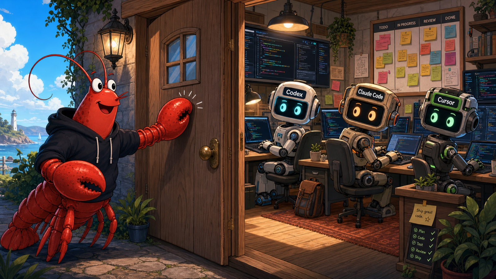

# Agent Knock Knock (AKK)

[](https://www.npmjs.com/package/@scotthuang/agent-knock-knock)
[](https://nodejs.org/)
[](https://github.com/scotthuang/agent-knock-knock/blob/main/LICENSE)

Agent Knock Knock lets **OpenClaw** control your existing **Codex CLI, Codex Desktop, and Claude Code** conversations. Watch work without staring at a terminal, send the next instruction from chat, and get callbacks when the coding agent finishes or needs attention.

AKK never launches a hidden replacement agent. The controller Host, the human, and AKK all use the same visible conversation and native coding-agent session.

**Stay in the terminal. Stay in control. No hooks. No agent-side plugins. No YOLO.**

*Codex CLI 0.159 and later support direct control. For earlier versions, use tmux or Herdr.*



## Install for OpenClaw

You need OpenClaw `2026.6.5`+, Node.js `22.19.0`+, and a supported Codex Desktop app or authenticated `codex` or `claude` CLI running as the same OS user.

Use ClawHub for the OpenClaw plugin, including the 0.14 backend and Desktop features:

```bash
openclaw plugins install clawhub:@scotthuang/agent-knock-knock
```

If the installer asks you to restart the Gateway, run `openclaw gateway restart`.

**For Codex CLI 0.159 or later, or Codex Desktop, keep your conversation open.**
You can connect directly without tmux or Herdr.
See the [CLI guide](docs/codex-cli-native-compatibility.md) or
[Desktop guide](docs/codex-desktop-compatibility.md) for supported setups.

In OpenClaw, first send:

```text
/akk list
```

Choose a conversation by project and title, then send a separate message:

```text
Use AKK to ask Codex in my-project to run the tests and summarize any failures.
Tell me when it's done.
```

AKK chooses the connection for you. Keep the task/Watch ID returned by Send
to check its status later. To follow a task you already started yourself,
ask OpenClaw to Watch that conversation.

**For Codex CLI versions earlier than 0.159, or Claude Code terminal controls, use tmux or Herdr.**
To use tmux, start the coding agent in your project:

```bash
cd /absolute/path/to/project
tmux new-session -s akk-work -c "$(pwd -P)" codex
```

Use `claude` instead of `codex` if preferred. Herdr users can follow the [Herdr quick start](docs/quickstart-herdr.md).

For this terminal setup, first send in OpenClaw:

```text
/akk doctor
```

After `AKK doctor: ready`, send a separate message:

```text
/akk inspect this repository and summarize it
```

That is the terminal first-task flow. For terminal setup and multiple panes, see the [tmux quick start](docs/quickstart-tmux.md). Direct `/akk ...` commands need no OpenClaw tool-policy changes. For natural-language tool access and installation help, see the [OpenClaw guide](docs/openclaw-operations.md).

## Install for Pi

Pi can be the controller Host without OpenClaw. The current connector targets Pi `0.84.4`:

This connector currently depends on AKK `0.13.3`; the new 0.14 direct CLI and Desktop capabilities described above apply to the OpenClaw plugin. Follow the connector guide for its supported features.

```bash
npm install -g @earendil-works/pi-coding-agent@0.84.4
pi install npm:@scotthuang/agent-knock-knock-pi@next
pi
```

Pi should show `AKK ready`. With Codex or Claude Code already running in tmux or Herdr, enter `/akk list`. The connector provides `/akk`, the complete capability-handshake-verified semantic tool catalog, the bundled `agent-knock-knock` skill, callbacks to the initiating Pi session, and native approval dialogs. See the [Pi connector guide](connectors/pi/README.md).

## Install for DeepSeek Harness

The connector supports DeepSeek Harness Web `0.1.1-rc.2`, `0.1.2-alpha.1`, and
`0.1.5-rc.2`:

This connector currently depends on AKK `0.13.3`; its supported features are documented separately from the OpenClaw plugin's 0.14 direct CLI and Desktop capabilities.

```bash
dsh plugin --profile web add @scotthuang/agent-knock-knock-deepseek-harness@next
dsh web
```

Open a Web conversation and enter `/akk list`. The connector gives every conversation `/akk`, the same capability-handshake-verified semantic tool catalog, the bundled `agent-knock-knock` skill, and callbacks to the exact Harness Agent that initiated the work. See the [DeepSeek Harness connector guide](connectors/deepseek-harness/README.md).

## See It in Action

[](https://github.com/scotthuang/agent-knock-knock/blob/main/docs/assets/akk-tmux-handoff-demo.mp4)

*OpenClaw asks Claude Code to write a file, waits for AKK to report completion, then hands the result to Codex. Both terminals remain available for direct human control. This demo uses tmux; supported Codex CLI and Desktop connections no longer need it. Click the preview for the full-quality video.*

## What AKK Gives You

AKK 0.14.0 introduces Codex CLI shared-backend control, Codex Desktop support, and exact-task recovery. Desktop includes discovery, task sending, Status, and exact task Watches. List follows saved Desktop sidebar membership and keeps unconnected entries visible; open a conversation in Desktop before sending to it. Desktop supports command/file approval decisions, blocking and asynchronous answers, per-conversation permissions, explicit model and Plan/default settings, and exact task cancellation. See [Desktop compatibility and usage](docs/codex-desktop-compatibility.md).

Codex CLI sessions connected to a shared backend can also be controlled directly, without tmux or Herdr. Native CLI rows support task sending, exact Watch and callbacks, command/file approvals, blocking and asynchronous answers, and per-thread permission settings. See the [CLI shared-backend guide](docs/codex-cli-native-compatibility.md).

AKK 0.14.3 also adds [Claude Code direct control](docs/claude-cli-direct.md): discover an already-open CLI, send tasks, read progress, and receive completion callbacks without tmux/Herdr, Claude plugins, or hooks. Live-tested on macOS with Claude Code `2.1.296`; requires Python 3 on the AKK side.

The existing terminal workflows remain available for Codex or Claude Code running in tmux or Herdr:

Codex CLI 0.158.0/0.159.0/0.159.2/0.159.3/0.160.0/0.162.1 supports exact paginated task Watches for ordinary terminal
Send, native question responses, and durable completion callbacks. The adapter
checks the foreground thread and required backend protocol before attaching; uncertain
answers are never automatically replayed. See the [0.162.1 review](docs/codex-0.162.1-compatibility.md)
and [earlier compatibility review](docs/codex-0.160.0-compatibility.md) for managed-session and already-open
question boundaries. Codex 0.157.x retains its [partial compatibility](docs/codex-0.157.1-compatibility.md).

- **Watch without babysitting.** Ask OpenClaw to Watch an ongoing CLI or Desktop task, or use `/akk watch <terminal>` for a terminal. Get a callback when it finishes, needs approval, or becomes blocked. You can leave the coding agent and continue from your phone or another chat client.
- **Send without typing in a tiny remote console.** Ask OpenClaw to send to a listed conversation, or use `/akk <selector>: <message>` for a terminal. Send attaches monitoring when the exact task can be verified; its receipt tells you whether a callback is expected. You do not need a second Watch for that same task. An explicit user Send has priority over stale AKK management state.
- **Identify an ambiguous Codex foreground explicitly.** When several rollout files or a recent `/clear` prevent durable attribution, an advertised foreground-identification action can inspect one exact idle pane without guessing which rollout is current.
- **Set Codex permissions before a task.** `/akk permissions <exact-terminal-id>` reads the current setting and native choices; `/akk set-permissions <exact-terminal-id> <advertised-mode-id>` applies your selected mode to that idle session and verifies it before Send. Full Access works like the other options; AKK handles its native confirmation automatically without an extra user prompt. See [Codex permissions](docs/codex-permissions.md).
- **Switch models through the native catalog.** `/akk models <exact-terminal-id>` lists the choices currently offered by one exact physical Codex or Claude Code pane; a Codex rollout/native-thread attribution is not required, so this also works before the first rollout materializes. `/akk set-model ...` consumes one exact advertised model/reasoning-effort tuple without accepting raw slash commands, keys, or menu indexes. Codex synchronizes the model and ordinary efforts through `max` to the current and future-session defaults; its `ultra` effort is current-session-only, and the native UI does not expose the exact non-Ultra effort chosen for future sessions, so AKK omits that unobservable field. Claude Code changes only the current session.
- **Continue or clear only a proven model-control residue.** If a failed model-control attempt in a reviewed Codex profile leaves an exact `/model` completion surface or bare `/model` Composer, a fresh List may advertise both `/akk models <exact-terminal-id>` and `/akk repair-model-control <exact-terminal-id>`. Models uses a separate residual-bound authority to continue that exact native slash command into read-only catalog discovery without retyping it. If the exact native picker is already open, List marks the pane non-idle and exposes repair where supported. Repair remains the cleanup-only escape hatch, never presses Enter, and must prove an empty Composer.
- **Inspect and recover.** `/akk status <turn-or-watch>` shows current state when a callback is delayed. Direct CLI and Desktop Status also include a short public progress summary. Send and Watch default to a 12-hour hard deadline; managed terminal tasks retain their separate 60-minute inactivity limit. Durable callback records and Watches provide a recovery path after transient Host failures. See [Backend Recovery](docs/backend-task-recovery.md).
- **Approve deliberately in supported conversations.** AKK can surface Codex or Claude Code permission requests and submit an explicit human decision. It preserves the coding agent's existing permission mode. Desktop exposes typed command/file approvals and blocking or asynchronous answers through the original conversation owner.
- **Hand control back and forth.** Return to the same Codex CLI, Desktop conversation, or tmux/Herdr pane whenever you want. AKK does not create a parallel hidden conversation.

For terminal workflows, common commands are shown below. Watch is for work
already running; model changes require an idle session. These are separate
actions, not a sequence to run before every Send. Direct CLI and Desktop users
can ask OpenClaw for the corresponding advertised action on their selected conversation.

```text
/akk list
/akk watch <exact-terminal-id>
/akk models <exact-terminal-id>
/akk set-model <exact-terminal-id> <advertised-model-id> <advertised-reasoning-effort>
/akk codex: run the tests and explain any failures
/akk status <turn-id-or-watch-id>
```

If List advertises `repair-model-control`, it is an alternative cleanup flow:

```text
/akk repair-model-control <exact-terminal-id>
/akk list
/akk models <exact-terminal-id>
/akk set-model <exact-terminal-id> <advertised-model-id> <advertised-reasoning-effort>
```

Use identifiers and actions from a fresh `/akk list`; do not guess or cache terminal IDs. Terminal model switching is fail-closed: the same exact physical pane/process must still be free of an active Turn or any input-owning approval, questionnaire/editor, or read-only viewer, and must show either an exact idle empty Composer or a supported profiled `/model` residual. A reviewed Codex profile may allow model control before the first rollout; Claude Code still requires its exact current native Session. When List advertises both actions for a Composer residual, `model_options` may continue it into the catalog while `repair_model_control` only clears it. If continuation, repair, or model switching reports `uncertain`, inspect the pane instead of retrying automatically. See the [operator guide](docs/operator-guide.md) for version-specific behavior.

## How It Works

```text
          OpenClaw / Pi / DeepSeek Harness
                         │
                  AKK Host adapter
                         │
             Session · Turn · Watch · Callback
                         │
          ┌──────────────┼─────────────────┐
  Codex CLI backend  Codex Desktop IPC  tmux / Herdr
          │              │                 │
   Original CLI     Original Desktop   Codex / Claude Code
   conversation       conversation
```

For Codex CLI, AKK prefers the shared backend when it verifies the exact live conversation. You select a conversation and an action; AKK selects the connection. Before dispatch, an unavailable backend or unsupported operation may use a verified terminal route. Busy, blocked, or uncertain results do not trigger a retry through another connection.

For a terminal-managed Send, AKK verifies the selected terminal and coding-agent process, writes one user request, monitors that exact Turn, and returns completion or attention callbacks to the initiating Host session. If stale AKK bookkeeping blocks an explicit Codex Send before terminal input, AKK can fall back to a verified one-time physical Send and attach a task Watch for callback and Status recovery.

Desktop uses a separate adapter. It combines a read-only catalog with live owner discovery, verifies the exact thread, submits at most once, and records the accepted native task for monitoring. It does not start a CLI to replay Desktop history. An uncertain submission is reconciled from native evidence and never automatically resent.

Native Pi and DeepSeek Harness connectors accept the shared catalog through a
versioned, secretless Host Adapter capability handshake. Startup verifies the
ordered semantic tool registration and the bundled Skill against catalog and
Skill SHA-256 digests; an older, missing, or drifted handshake fails closed
instead of mounting a partial tool surface. Connector package versions remain
independent of one another.

An idle Codex pane with ambiguous foreground identity may advertise `identify_foreground`, which performs a bounded native `/status` inspection. List never types into terminals. Targeted operations, including conversation Status, may also use a protected `/status` inspection on an idle, empty terminal to establish its exact backend identity. They do not interrupt a working or blocked terminal to discover that identity. Task acceptance and completion still require evidence from the exact native task; a status card alone is not proof. See [CLI routing and identity](docs/codex-cli-native-compatibility.md#automatic-conversation-routing-2026-10-10).

AKK is local-first: there is no hosted control plane or telemetry. It stores only the local state needed for routing, lifecycle recovery, callback delivery, and idempotency.

## Compatibility

Codex CLI shared-backend connections and Codex Desktop work without tmux or Herdr
when the conditions below are met. Older CLI setups without a direct connection
can use a supported terminal route. Claude Code direct control is available under the separate boundary below.

| Component | Supported boundary |
| --- | --- |
| Terminal hosts | tmux; local Herdr `0.8.0` protocol `19` |
| Codex Desktop | macOS app `26.1002.52244`, build `13536`; this **exact build**, plus an open connected conversation, is required for sending and other controls. Supports Status, exact Watch, approvals/answers, settings, and cancellation. |
| Codex CLI shared backend | Live-tested on macOS: CLI `0.162.1` + backend `0.162.1`, and previously `0.160.0` + `0.162.0`. Requires a loaded main CLI conversation and compatible live protocol. These are tested combinations, **not a numeric minimum**. |
| Claude Code direct connection | macOS, live-tested `2.1.296`, compatible native peer protocol `1`, and Python 3 available to AKK. Basic task sending, progress and completion observation; unsupported controls require the original terminal. See the [direct guide](docs/claude-cli-direct.md). |
| Terminal coding agents | Reviewed Codex profiles include `0.160.0` and `0.162.1`; Claude Code `2.1.285` was tested on macOS. Unknown versions may expose limited capabilities; native controls depend on the reviewed profile and current UI. |
| OpenClaw | `2026.6.5`+; plugin API and Gateway `2026.5.12`+ |
| Pi connector | Pi `0.84.4`; connector currently depends on AKK `0.13.3` |
| DeepSeek Harness connector | `0.1.1-rc.2`, `0.1.2-alpha.1`, and `0.1.5-rc.2`; connector currently depends on AKK `0.13.3` |
| Runtime | Node.js `22.19.0`+ on macOS or Linux |

The adjacent OpenClaw boundary `2026.5.10-beta.2` is intentionally unsupported. Herdr and Desktop controls depend on reviewed private protocol versions. Desktop catalog presence alone does not prove the conversation is open or controllable. See each connector guide and the Desktop guide for tested boundaries and limitations.

Codex CLI model changes and cancellation still require an eligible terminal.
New/clear/resume operations for paginated Codex CLI `0.158+`, and creating or
cold-loading Desktop conversations, remain unsupported. Desktop can set an
explicit model but cannot query a model catalog. See the
[0.162.1 verification record](docs/codex-0.162.1-compatibility.md) for tested
operations and remaining limits; a newer version alone is not a compatibility guarantee.

## Documentation

Choose the guide that matches what you are trying to do:

| Guide | Use it for |
| --- | --- |
| [tmux quick start](docs/quickstart-tmux.md) | First OpenClaw task, multiple panes, and selectors |
| [Herdr quick start](docs/quickstart-herdr.md) | Local Herdr discovery and exact-version checks |
| [Codex CLI direct control](docs/codex-cli-native-compatibility.md) | Connect without tmux/Herdr, select conversations, send tasks, and follow exact progress and completion |
| [Claude Code direct control](docs/claude-cli-direct.md) | Basic tasks without tmux/Herdr or Claude plugins, exact progress and completion, and terminal fallback boundaries |
| [Codex Desktop](docs/codex-desktop-compatibility.md) | Discover existing Desktop conversations, send and monitor exact tasks, respond to interactions, and change native settings |
| [Backend Recovery](docs/backend-task-recovery.md) | Recover monitoring, renew deadlines, close management, stop watching, and retry failed callbacks |
| [Pi connector](connectors/pi/README.md) | Pi installation, semantic tool catalog, bundled skill, native approval, callbacks, upgrade, and uninstall |
| [DeepSeek Harness connector](connectors/deepseek-harness/README.md) | Harness installation, approval contract, callbacks, upgrade, and troubleshooting |
| [Operator guide](docs/operator-guide.md) | Complete command reference, reliable Send, Watch, Status, approval, recovery, Sessions, and native threads |
| [OpenClaw operations](docs/openclaw-operations.md) | npm alternative, configuration, auto-approval policy, supervisor behavior, and troubleshooting |
| [Host Bridge and Profiles](docs/host-bridge-profiles.md) | Connect another controller Host through MCP/stdio and a declarative Profile |
| [Terminal handoff protocol](docs/bidirectional-agent-protocol.md) | Identity, Turn lifecycle, callback guarantees, safety fences, and handoff semantics |
| [Storage and logging](docs/storage-and-logging.md) | State directories, permissions, protocol migration, logs, and privacy |
| [Testing](docs/testing.md) | Test tiers, architecture checks, and evidence workflows |
| [Contributing](CONTRIBUTING.md) | Local development and contribution workflow |

## Installation Alternatives

OpenClaw users who prefer npm can install the same core package directly:

```bash
npm install -g @scotthuang/agent-knock-knock
agent-knock-knock install-openclaw --verify
```

ClawHub remains the recommended OpenClaw path. Do not install both variants into the same OpenClaw profile.

To build the repository locally, see [local development installation](docs/openclaw-operations.md#local-development-build):

```bash
npm install
npm run build
npm run test:fast
```

Connector development uses `npm run pi:build` from the repository root, or `cd connectors/pi && npm run build`; DeepSeek Harness has the matching `npm run deepseek:build` script.

## Security and Privacy

AKK controls local coding-agent sessions, so treat installation as privileged local automation. Use an unprivileged OS account, restrict backend, tmux, Herdr, and Desktop IPC sockets, keep the state directory private, and review approval prompts before allowing input. Ordinary AKK Send does not change agent permissions or require YOLO mode. Desktop tasks inherit that conversation's current settings. Respond to supported approvals and questions through their advertised actions; unknown request forms remain manual. The explicit Codex permission tool applies only the user-selected native mode; model-facing tools never receive terminal-control tokens, callback credentials, Composer text, or approval fingerprints.

Report vulnerabilities privately using [GitHub Security Advisories](https://github.com/scotthuang/agent-knock-knock/security/advisories/new). Please do not include secrets, private terminal output, or credentials in a public issue.

## License

[MIT](LICENSE)
